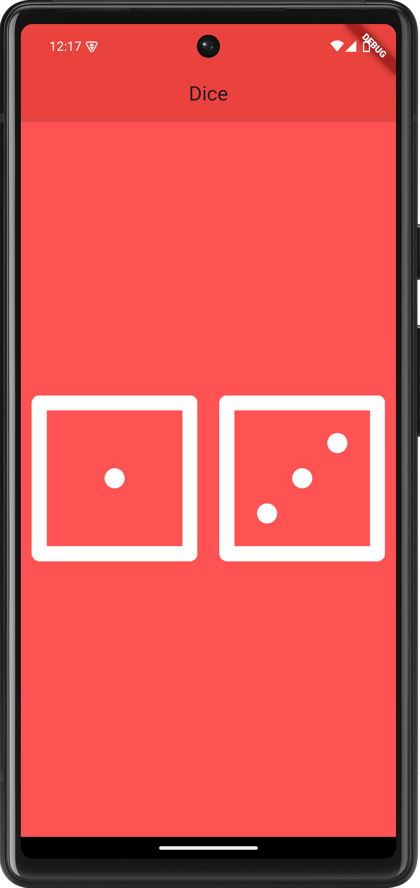

# dice_flutter

A new Flutter project, that gives random numbers from two dice. 

## Screenshot



## Profile

Hello! I'm [Kazi Abrar Shafin], a passionate app developer with experience in building cross-platform applications using Flutter.

## Contact

- **Email**: [kazishafin09@gmail.com](mailto:kazishafin09@gmail.com)
- **Phone**: [+8801637231961](tel:+8801637231961)

## Getting Started

To run this project locally, follow these steps:

1. Clone the repository:
    ```bash
    git clone https://github.com/AbrarShafin/mi_card.git
    ```
2. Navigate to the project directory:
    ```bash
    cd dice_flutter
    ```
3. Install dependencies:
    ```bash
    flutter pub get
    ```
4. Run the app:
    ```bash
    flutter run
    ```

## Contributing

Contributions are welcome! Feel free to open an issue or submit a pull request.
